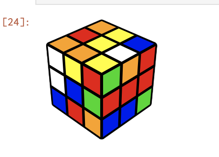
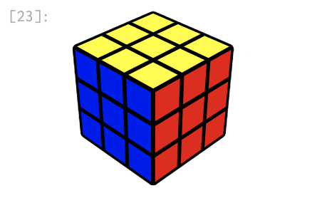

# GapjlRubik
GAP.jlを使用して、Rubikキューブをとく

# Usage
```
docker build . -t gapjlrubik
docker run -d -p 8888:8888 gapjlrubik
open http://127.0.0.1:8888/
```

# 回転
```
u = ( 1, 3, 8, 6) * ( 2, 5, 7, 4) * ( 9,33,25,17) * (10,34,26,18) * (11,35,27,19)
l = ( 9,11,16,14) * (10,13,15,12) * ( 1,17,41,40) * ( 4,20,44,37) * ( 6,22,46,35);
f = (17,19,24,22) * (18,21,23,20) * ( 6,25,43,16) * ( 7,28,42,13) * ( 8,30,41,11);
r = (25,27,32,30) * (26,29,31,28) * ( 3,38,43,19) * ( 5,36,45,21) * ( 8,33,48,24);
b = (33,35,40,38) * (34,37,39,36) * ( 3, 9,46,32) * ( 2,12,47,29) * ( 1,14,48,27);
d = (41,43,48,46) * (42,45,47,44) * (14,22,30,38) * (15,23,31,39) * (16,24,32,40);
```

# こんな感じ

```
状態: (1,11,40,9,6,14,35,17,46)(2,7,10,21,36,5,44,34,18,4,28,29,26,15)(3,19,27,25,33,8)(13,39,20,47)(16,43,41,30,22,24)(23,31)(32,38,48)(42,45)
```



問題をとくと。。。
```
解: L*D^-1*F^-1*R^2*B*D^2*B^-1*U^2*D^-1*B^-1*D*L*D^-1*L^-1*D*F^-1*U*F*U^2*F*L*F^-1*L^-1*F^-1*L*B^-1*U*B*L^-2*B*L^-1*B^-1*L^-1*U^-1*L^-1*U*L^-1*F^-1*L^-1*F*L*U^-1*F*U^-1*F^-1*L*F^-1*L^-1*F*L^-1*U^-1*L*F*R*U*R^-1*U^-1*F^-1*U*F*U*R*U^-1*R^-1*F^-1*U*L*U^2*L^-1*U^-1*L*U^-1*L^-1*U*L*F^-1*L^-1*F*U*F*U^-1*F^2*L*F*L^-1*U^-1*L^-1*U*L*U*F*R*U*R^-1*U^-1*F^-1*U^-1*L^-1*U^-1*B^-1*U*B*L
```



# 様子をみたかったら。。。
[ここ](./process)みてね。

```
open process/process1.html
```
